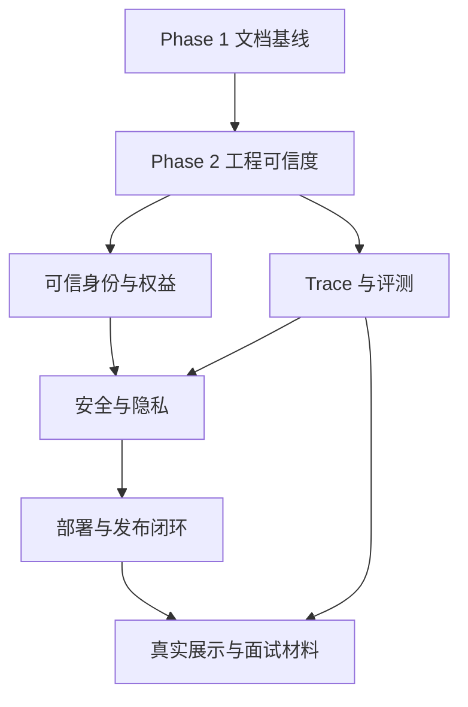

# AI Agent 面试代表作打磨 Implementation Plan

> **For agentic workers:** 后续阶段必须先阅读 [`PROJECT_REVIEW.md`](PROJECT_REVIEW.md)；执行代码阶段时使用 `superpowers:subagent-driven-development`（推荐）或 `superpowers:executing-plans`，逐项实现、验证和复查。

**Goal:** 在不大规模重构、不删除功能、不引入重型依赖的前提下，把本项目逐步打磨成适合 AI Agent 工程师或 LLM 应用开发面试展示的代表作。

**Architecture:** 保留 FastAPI + Next.js + SQLModel 的现有边界，以“可信身份与权限 → Agent 可观测性与评测 → 安全可靠性 → 发布与演示”顺序渐进增强。每个阶段独立设计、独立验收，禁止借路线图一次性重写系统。

**Tech Stack:** Python 3.11+、FastAPI、SQLModel、Alembic、HTTPX、Pytest、Next.js 15、React 19、TypeScript、Vitest、Docker、GitHub Actions、PowerShell。

**Spec:** [`PROJECT_REVIEW.md`](PROJECT_REVIEW.md)

## Global Constraints

- 第一阶段只修改文档和展示资源。
- 不删除或弱化现有公开内容、聊天、微信公众号、智能分析、后台和部署功能。
- 不以“架构升级”为由进行一次性大规模重构。
- 优先使用现有依赖；引入任何新依赖前必须证明标准库或现有依赖无法合理完成目标。
- 不提交 `.env`、真实 API Key、管理员 token、微信 token、App ID、AES Key、数据库或用户数据。
- 所有“已通过”“已部署”“已修复”声明必须附实际命令、日期和 commit SHA。
- 所有安全结论先写回归测试，再修改实现；所有模型质量结论必须来自固定评测集。
- 招生、排名和志愿建议数据必须标注来源、适用年份、地区和免责声明。

---

## 路线图总览

| 阶段 | 目标 | 关键产物 | 退出条件 | 本轮状态 |
|---|---|---|---|---|
| Phase 1 | 建立面试官可快速理解的项目叙事 | README、PROJECT_REVIEW、PLAN、截图占位 | 文档事实一致、链接有效、没有业务代码改动 | 已完成（2026-08-25） |
| Phase 2 | 恢复可追溯的工程可信度 | 冒烟修复、验证记录、Release 门禁、统一数据源 | 干净基线完整验证通过，Tag 不能绕过 CI | 工作项 2.1—2.8 已完成；外部发布验证待环境 |
| Phase 3 | 补齐 Agent 工程证据 | 会话模型、trace、离线评测集、评测报告 | 可重复量化路由、结构化输出、降级和延迟 | 3.1—3.7 已完成 |
| Phase 4 | 收紧身份、安全和运营可靠性 | 身份上下文、权益边界、微信幂等、URL 防护、后台错误反馈 | 权限与安全回归测试通过，失败对用户和运营可见 | 4.1—4.9 已完成 |
| Phase 5 | 完成部署与面试展示闭环 | 环境化发布、备份回滚、真实截图、演示视频、面试讲稿 | 新环境可复现部署并完成三分钟 Demo | 5.1—5.4、5.6、5.8 已完成；5.5 本地 smoke/版本断言已验证但生产发布/回滚待外部确认；5.7 本地视频已完成播放复核并补充按时间轴对齐的 WebVTT 字幕，旁白可选 |
| Phase 6 | 明确与通用大模型的差异化定位 | README 对比、面试问答、证据链接 | 面试官能区分“模型能力”与“应用工程能力”，且不夸大项目边界 | 6.1—6.2 已完成（2026-08-26） |

## Phase 1：文档与展示增强

### Task 1：固化项目评审

**Files:**

- Create: `PROJECT_REVIEW.md`

**Interfaces:**

- Consumes: 当前仓库源码、测试、配置、历史文档和 Git 状态。
- Produces: 后续所有路线图任务使用的事实基线、风险优先级和面试叙事。

- [x] 盘点 256 个跟踪文件和当前未提交工作区。
- [x] 绘制系统架构与聊天执行链路。
- [x] 建立 Agent/LLM 能力证据矩阵。
- [x] 区分已验证事实、静态审查发现和未知运行状态。
- [x] 记录 P0/P1/P2 风险、文档不一致和面试建议。

**Acceptance:** 关键能力与高优先级问题都能追溯到具体代码、配置或测试目录；不声称本次未执行的测试已经通过。

### Task 2：建立完整路线图

**Files:**

- Create: `PLAN.md`

**Interfaces:**

- Consumes: `PROJECT_REVIEW.md` 中的优先级与全局约束。
- Produces: 每个后续阶段的范围、文件候选、验证命令和退出条件。

- [x] 明确 Phase 1 只做文档。
- [x] 把可信度、Agent 评测、安全、发布和展示拆成独立阶段。
- [x] 为每项任务定义验收标准与依赖关系。
- [x] 增加风险控制、密钥检查和事实声明规则。

**Acceptance:** 任一未来任务都能被单独立项，不需要通过大规模重构才能开始。

### Task 3：改造面试官 README

**Files:**

- Modify: `README.md`
- Create: `docs/assets/readme-overview-placeholder.svg`

**Interfaces:**

- Consumes: `PROJECT_REVIEW.md` 的事实与 `PLAN.md` 的边界。
- Produces: GitHub 项目首页、三分钟阅读路径和 Demo 入口。

- [x] 顶部加入一句话介绍。
- [x] 顶部加入可见截图占位。
- [x] 加入“三分钟看懂项目”。
- [x] 加入系统架构图和 Agent 请求链路。
- [x] 展示核心能力、关键取舍、失败降级和运营闭环。
- [x] 保留快速启动、环境变量、测试、部署和安全说明。
- [x] 加入三分钟面试 Demo 脚本与深度文档入口。

**Acceptance:** 面试官不运行代码也能在三分钟内回答“解决什么问题、Agent 如何工作、工程难点是什么、如何验证”。

### Task 4：文档验证

**Files:**

- Verify: `README.md`
- Verify: `PROJECT_REVIEW.md`
- Verify: `PLAN.md`
- Verify: `docs/assets/readme-overview-placeholder.svg`

- [x] 检查所有相对链接目标存在。
- [x] 检查 Markdown 标题层级和 Mermaid 代码块闭合。
- [x] 扫描真实密钥、高风险占位和不可验证的完成声明。
- [x] 运行 `git diff --check`。
- [x] 确认 Git diff 没有修改业务代码或覆盖用户原有改动。

**Acceptance:** 文档检查全部通过；最终报告明确哪些验证执行过、哪些未执行。

## Phase 2：工程可信度与可复现基线

> 进入本阶段前，为每个 Task 单独写设计说明并取得确认；不要与 Phase 3 同时实施。

| ID | 优先级 | 工作项 | 候选文件 | 验收标准 | 依赖 |
|---|---|---|---|---|---|
| 2.1 | P0 | 修复本地冒烟脚本 `$repoRoot` 初始化回归 | `scripts/smoke-local-stack.ps1`、对应脚本测试/验证脚本 | `-DryRun` 与真实本地 smoke 均通过；保留虚拟环境 Python 目标 | 当前用户改动确认 |
| 2.2 | P0 | 建立可追溯验证记录 | `README.md`、可选 `docs/verification/` | 记录日期、完整 commit、运行环境、命令和结果；禁止复制历史数字 | 2.1 |
| 2.3 | P0 | 修正 Release 门禁 | `.github/workflows/ci.yml`、`.github/workflows/release.yml` | Tag 镜像发布只能使用已通过同一 commit CI 的工件或复用工作流 | CI 设计确认 |
| 2.4 | P0 | 修正 Web 生产 API 地址策略 | Dockerfile、Compose、Release workflow、部署文档 | 远程浏览器不再默认请求自身 `localhost:8000` | 2.3 |
| 2.5 | P1 | 统一 JSON 数据源 | `data/`、`apps/data/`、播种脚本、文档 | 根目录 `data/` 为唯一权威源；CI 校验 slug、关联和 JSON 结构；重复目录不进入发布 | 已完成；本地 legacy duplicate 保留但 CI 严格拒绝 |
| 2.6 | P1 | 对齐运行时版本文档 | `pyproject.toml`、CI、运维手册、部署模板 | Python 3.11+、Node.js 20+ 最低版本在所有入口一致 | 无 |
| 2.7 | P1 | 增加类型与覆盖率证据 | Web scripts、Pytest/Vitest 配置、CI | 独立 typecheck；生成覆盖率报告并先观察后设合理门槛 | 2.2 |
| 2.8 | P1 | 增加最小端到端冒烟 | 现有 smoke 或轻量浏览器脚本 | 覆盖公开页、聊天降级、后台读取三条主路径，不引入重型测试平台除非必要 | 2.1、2.4 |

### Phase 2.1 执行记录

| 项目 | 记录 |
|---|---|
| 日期 | 2026-08-25 |
| 基线 | `main` / `772948a`；工作区仍包含用户原有未提交改动 |
| 根因 | `scripts/smoke-local-stack.ps1` 在 `$repoRoot` 初始化前构造 `$apiVenvPython` |
| 最小修复 | 在 `$apiVenvPython` 前恢复 `$repoRoot = Resolve-Path (Join-Path $PSScriptRoot '..')` |
| RED | `powershell -NoProfile -ExecutionPolicy Bypass -File .\\scripts\\smoke-local-stack.ps1 -DryRun -SkipAdminCheck -SkipChatProbe -SkipWechatProbe -SkipWechatOfficialAccountProbe`；稳定失败：`VariableIsUndefined` |
| GREEN | 同一条 `-DryRun` 命令退出码 `0`，完成 API、Chat、Web、Admin 探针构造 |
| Live smoke | 使用 `apps/api/.env.example`、`apps/web/.env.example`、`off` 模式、临时管理员/微信值和 `.tmp` 绝对路径 SQLite；API、Web、Chat、Admin、微信适配器、公众号明文/AES 探针全部完成，退出码 `0` |
| 清理 | 使用 `scripts/stop-local-stack.ps1 -StateFilePath .\\.tmp\\phase2-smoke.state.json` 停止 API/Web；停止命令退出码 `0`，8000/3000 端口已释放 |
| 后续验证 | GitHub Release 尚未实际触发；Docker Web 镜像构建因本机 Docker Desktop Linux daemon 未运行而未完成 |

本次真实 smoke 的临时数据库位于 `.tmp/phase2-smoke.db`，属于被忽略的本地运行产物；没有读取或输出真实 `.env` 值。

推荐验证命令：

```powershell
powershell -ExecutionPolicy Bypass -File scripts/verify-project.ps1
powershell -ExecutionPolicy Bypass -File scripts/start-local-stack.ps1 -RunSmoke
git diff --check
```

### Phase 2.2—2.8 执行记录

详细命令、环境、输出摘要和未完成项见 [`docs/verification/2026-08-25-phase2-verification.md`](docs/verification/2026-08-25-phase2-verification.md)。本轮基线 HEAD 为 `772948a6f6fe28b353007b009658e277f07475ed`，当前工作树尚未提交。

| ID | 结果 | 证据 |
|---|---|---|
| 2.2 | 已完成本地可追溯验证 | `verify-project.ps1` 退出码 `0`；Phase 2 当时 API `152 passed`、Web `124 passed`；生产构建通过；lint 仅 3 个 `` 警告；最新回归见 Phase 3.2 记录 |
| 2.3 | 已完成工作流门禁改造 | `ci.yml` 增加 `workflow_call`；`release.yml` 的 `ci-pass` 复用同一 workflow；GitHub tag 尚未实际触发 |
| 2.4 | 已完成配置策略改造 | Web Dockerfile/Compose 要求显式 API 根地址；Release 从 `production` Environment 读取并校验 URL；实际 Docker 构建受本机 daemon 未运行阻塞 |
| 2.5 | 已完成权威源与门禁收口 | 新增标准库 JSON 校验器并接入本地验证/CI；根目录 `data/` 校验通过（2 所学校、4 个专业）；本地 `apps/data/` 不删除，CI 使用 `--fail-on-legacy-duplicate` 防止重复目录进入仓库发布 |
| 2.6 | 已完成文档对齐 | 运维交接手册、项目评审、CI 说明统一为 Python 3.11+；Node.js 20+ 与 Docker/CI 保持一致 |
| 2.7 | 已完成观察基线 | 新增独立 `typecheck`，并接入 pytest-cov/Vitest V8 覆盖率报告；本轮未设置覆盖率门槛，先记录真实基线 |
| 2.8 | 已完成现有 smoke 验收 | 复用 `scripts/smoke-local-stack.ps1`：公开首页、聊天页、后台页、API 聊天降级结构化输出和后台智能分析设置均有断言；未引入浏览器平台 |

## Phase 3：Agent 可观测性、会话与评测

| ID | 优先级 | 工作项 | 最小实现方向 | 验收标准 | 明确不做 |
|---|---|---|---|---|---|
| 3.1 | P0 | 定义 Agent trace schema | `AgentTraceRecorder` + 可注入 sink；记录 request/session 摘要、Skill 候选与选择、Provider、模型调用标记、耗时、降级原因；不记录密钥和完整敏感 Prompt | 一次请求可解释“为什么选择该 Skill、是否调用模型、为什么降级”；trace sink 故障不影响响应 | 不先接重型 APM、不持久化消息 |
| 3.2 | P1 | 持久化会话与消息 | 新增最小 SQLModel 会话/消息表、Alembic 迁移、30 天滚动保留、按用户读取/删除 API；Web 复用 `session_id` 并支持 URL 恢复展示 | 同一会话保存 user/assistant 消息；错误用户统一 404；过期数据在写路径清理；API/Web 回归通过 | 不实现复杂长期记忆、不把历史自动注入 Prompt |
| 3.3 | P0 | 建立离线评测数据集 | JSON/JSONL 固定样本，覆盖学校、专业、分数、歧义、越界和 Provider 故障 | 数据集可离线运行，不依赖真实密钥 | 不追求大规模语料 |
| 3.4 | P0 | 实现确定性评测 runner | 使用现有 Python 依赖统计路由、schema、fallback 和延迟 | 相同 commit 与配置可重复生成报告 | 不引入独立评测平台 |
| 3.5 | P1 | 建立评测基线 | 输出 Markdown/JSON 报告并记录 commit | 至少有 Skill 路由准确率、结构化输出成功率、降级正确率、P50/P95 延迟 | 不伪造线上指标 |
| 3.6 | P1 | Prompt/Skill 版本可追溯 | trace 与评测报告记录 Skill 版本和 Prompt 内容哈希 | 能比较两个版本的评测差异 | 不建设完整 Prompt CMS |
| 3.7 | P2 | 评估混合检索必要性 | 先测 SQL 未覆盖问题，再做小型 spike | 只有可量化收益才进入正式方案 | 不默认引入向量数据库 |

评测集至少覆盖：

- 明确学校查询、明确专业查询。
- 分数/位次定位与志愿策略。
- 信息不足时的澄清问题。
- 不属于高考领域的问题。
- Provider 未配置、超时、余额不足、非法 JSON。
- 用户无权益、全局关闭和全局开启。
- Prompt 注入、恶意 URL 和超长输入。

### Phase 3.1 执行记录

| 项目 | 记录 |
|---|---|
| 日期 | 2026-08-25 |
| 设计 | [`docs/superpowers/specs/2026-08-25-agent-trace-design.md`](docs/superpowers/specs/2026-08-25-agent-trace-design.md) |
| 实现 | [`apps/api/app/services/tracing.py`](apps/api/app/services/tracing.py)、`ConversationService` 注入式 sink、Skill invocation provider/model 标记 |
| 脱敏边界 | 不记录完整消息、Prompt、API Key、openid 或用户 ID 原值；session 只记录 SHA-256 前 16 位摘要 |
| 验证 | `test_chat_services.py` 覆盖 Provider 成功、Provider 失败、全局 fallback、敏感字段不泄露和 sink 故障隔离；完整结果见 [`docs/verification/2026-08-25-phase3.1-verification.md`](docs/verification/2026-08-25-phase3.1-verification.md) |
| 非目标 | 不新增运行时依赖，不引入 APM/消息队列，不改变公开聊天响应结构，不做会话持久化 |

### Phase 3.2 执行记录

| 项目 | 记录 |
|---|---|
| 日期 | 2026-08-25 |
| 设计 | [`docs/superpowers/specs/2026-08-25-chat-session-persistence-design.md`](docs/superpowers/specs/2026-08-25-chat-session-persistence-design.md) |
| 实现 | [`apps/api/app/models/chat.py`](apps/api/app/models/chat.py)、[`apps/api/app/services/chat_sessions.py`](apps/api/app/services/chat_sessions.py)、Alembic 迁移、聊天路由与 [`chat-api.ts`](apps/web/lib/chat-api.ts) |
| 行为 | 聊天响应返回 `session_id`；每次成功请求保存 user/assistant 消息；默认 30 天滚动保留；读取、续写、删除均校验 `user_id + session_id`；页面支持 `?session_id=...` 恢复历史展示 |
| 验证 | API `161 passed`、Web `127 passed`、覆盖率/typecheck/生产构建通过；迁移 upgrade/downgrade/upgrade 往返通过；完整命令和失败修复见 [`2026-08-25-phase3.2-verification.md`](docs/verification/2026-08-25-phase3.2-verification.md) |
| 安全边界 | 当前 `user_id` 仍来自请求参数，不能视为可信身份；不记录 trace 原文，不实现长期记忆或历史 Prompt 自动注入 |

### Phase 3.3—3.5 执行记录

| 项目 | 记录 |
|---|---|
| 日期 | 2026-08-25 |
| 数据集 | [`apps/api/evals/cases.json`](apps/api/evals/cases.json)，9 个固定样本，覆盖目录、分数策略、歧义、越界、Provider 未配置/失败/余额不足/非法 JSON/成功 |
| Runner | [`apps/api/app/evals/runner.py`](apps/api/app/evals/runner.py)，使用临时 SQLite、跟踪目录种子和离线 Provider stub，不访问真实模型 |
| 基线 | 路由准确率 `100%`；结构化输出成功率 `100%`；降级正确率 `100%`；本次本机 P50 `3.61 ms`、P95 `13.11 ms` |
| 报告 | [`2026-08-25-phase3.3-3.5-evaluation.md`](docs/verification/2026-08-25-phase3.3-3.5-evaluation.md) |
| 验证 | `tests/test_eval_runner.py`：3 passed；runner 全部 9 个样本通过；未新增运行时依赖 |

### Phase 3.6 执行记录

| 项目 | 记录 |
|---|---|
| 日期 | 2026-08-25 |
| 设计 | [`2026-08-25-agent-trace-design.md`](docs/superpowers/specs/2026-08-25-agent-trace-design.md) 的 Prompt/Skill 指纹扩展 |
| 实现 | `SkillMetadata.prompt_hash`、`AgentTraceRecorder` 内部 `prompt_hash`、离线评测 case 的 `skill_version`/`prompt_hash` 字段；公开 `matched_skill` 响应保持不变 |
| 脱敏规则 | Prompt asset 仅计算完整 SHA-256；trace/report 不记录 Prompt 路径、原文、API Key 或用户内容 |
| 验证 | Provider trace、公开契约和评测报告回归通过；当前 offline prompt fingerprint 为 `a3878eba6f5686813ee17d933622d9e4e7a18156beb03588a90071fe7f655e43` |

### Phase 3.7 执行记录

| 项目 | 记录 |
|---|---|
| 日期 | 2026-08-25 |
| 数据集 | [`apps/api/evals/retrieval-cases.json`](apps/api/evals/retrieval-cases.json)，6 个固定样本：已知学校、已知专业、开放式匹配、分数策略、榜单解释和目录外学校 |
| Spike | [`retrieval_spike.py`](apps/api/app/evals/retrieval_spike.py)，使用临时 SQLite 和现有 SQL catalog，不引入向量数据库或运行时依赖 |
| 结果 | 实际 SQL 覆盖 `33.33%`；期望覆盖 `33.33%`；标签一致率 `100%`；推荐 `keep_sql_first` |
| 决策 | 当前未发现需要立即引入混合检索的证据；先扩充真实非结构化问题样本，达到量化阈值后再重评估 |
| 报告 | [`2026-08-25-phase3.7-retrieval-spike.md`](docs/verification/2026-08-25-phase3.7-retrieval-spike.md) |
| 验证 | `tests/test_retrieval_spike.py`：2 passed；完整验证结果见 [`2026-08-25-phase3.6-3.7-verification.md`](docs/verification/2026-08-25-phase3.6-3.7-verification.md) |

## Phase 4：身份、安全与运营可靠性

| ID | 优先级 | 工作项 | 验收标准 | 前置 |
|---|---|---|---|---|
| 4.1 | P0 | 修复客户端权益合并 | 客户端 metadata 无法改变服务端模式或增加权益；回归测试先失败后通过 | 身份方案设计 |
| 4.2 | P0 | 建立可信用户上下文 | Web 使用服务端签发的 HMAC session；公众号只从已验签消息取 openid | 4.1 |
| 4.3 | P0 | 保护权益查询 | 用户只能查询自身权益，管理员路径继续使用管理认证 | 4.2 |
| 4.4 | P0 | 公众号重放与幂等防护 | 拒绝过期 timestamp；nonce/MsgId 重复不重复处理；请求体有限制 | 数据迁移设计 |
| 4.5 | P1 | URL 与媒体输入安全 | 仅允许 HTTP(S)；阻断本地/保留地址、凭据、重定向绕过、超限内容，并在媒体重试前复验 | 威胁模型 |
| 4.6 | P1 | 隐私与数据保留 | 明确会话、微信媒体、trace 的收集、脱敏、保留与删除规则 | 3.1、3.2 |
| 4.7 | P1 | 后台错误反馈 | Server Action 返回结构化状态，运营界面显示失败原因且不误报成功 | Web 交互设计 |
| 4.8 | P1 | 后台加载并发优化 | 独立请求使用 `Promise.allSettled`，保留分区降级 | 4.7 |
| 4.9 | P2 | 渐进拆分后台大组件 | 按业务域拆分，每次只移动一个分区并保持测试 | 4.7、4.8 |

### Phase 4.1 执行记录

| 项目 | 记录 |
|---|---|
| 日期 | 2026-08-25 |
| 设计 | [`trusted-entitlement-boundary-design.md`](docs/superpowers/specs/2026-08-25-trusted-entitlement-boundary-design.md) |
| 原因 | 原实现会把请求 `metadata.entitlements` 与数据库权益合并，并允许请求 `smart_analysis_mode` 覆盖服务端模式 |
| 实现 | [`ConversationService`](apps/api/app/services/chat.py) 在构造 `ChatRequestContext` 前，用数据库 `RuntimeSetting` 和 `UserEntitlement` 覆盖两个策略字段；离线评测 runner 改为在临时库显式播种服务端策略 |
| 回归 | 2 个服务层攻击回归 + 1 个 API 端到端伪造权益回归；定向聊天测试 `71 passed`，完整 API `169 passed` |
| 结果 | 客户端 metadata 无法把 `gated`/`off` 提升为可调用模型，也无法凭空增加 `smart_analysis` 权益；公开响应结构未改变 |
| 验证 | [`2026-08-25-phase4.1-verification.md`](docs/verification/2026-08-25-phase4.1-verification.md) |
| 剩余边界 | 平台权益查询主体、微信重放和账号级认证仍不在本阶段；可信聊天主体由 Phase 4.2 处理 |

### Phase 4.2 执行记录

| 项目 | 记录 |
|---|---|
| 日期 | 2026-08-25 |
| 设计 | [`trusted-user-context-design.md`](docs/superpowers/specs/2026-08-25-trusted-user-context-design.md) |
| 失败测试先行 | 首轮执行 `tests/test_auth_context.py` 时因认证服务尚不存在得到 `ModuleNotFoundError`；随后补齐实现并保留 5 个身份边界回归 |
| 实现 | [`apps/api/app/services/auth.py`](apps/api/app/services/auth.py) 使用 Python 标准库 HMAC 签发/解析 guest session；[`apps/api/app/routers/auth.py`](apps/api/app/routers/auth.py) 提供 `/api/auth/session`；聊天、会话和通用微信适配路由统一解析 Bearer/cookie 主体 |
| Web 边界 | `chat-api.ts` 使用 `credentials: include`；聊天页不再读取或提交 URL `openid`/`user_id`；服务端 cookie 为 HTTP-only、SameSite=Lax，生产-like 环境要求非默认 session secret |
| 兼容策略 | 开发/测试保留显式 `user_id`/`openid` 回退以支持本地 fixture；生产-like 环境无有效 token 时拒绝声称身份，token 与 claim 不一致时返回拒绝 |
| 定向回归 | 认证/配置 `15 passed`；聊天、API 与会话 `53 passed`；Web 相关定向 `10 passed` |
| 完整验证 | API `174 passed`、Python 总覆盖率 `84%`；Web `127 passed`、覆盖率 `86.86% / 84.35% / 71.73%`；typecheck、生产构建和 `scripts/verify-project.ps1` 通过 |
| 结果 | 生产-like 请求不能凭空指定主体；无 claim 的请求可获得服务端生成的匿名 guest session；官方账号已验签路径继续使用内部可信 `FromUserName` |
| 非目标 | 不引入 JWT/认证框架或运行时依赖；不实现账号注册、令牌撤销、平台权益查询授权和微信重放幂等 |
| 验证 | [`2026-08-25-phase4.2-verification.md`](docs/verification/2026-08-25-phase4.2-verification.md) |

### Phase 4.3 执行记录

| 项目 | 记录 |
|---|---|
| 日期 | 2026-08-25 |
| 设计 | [`trusted-platform-entitlement-design.md`](docs/superpowers/specs/2026-08-25-trusted-platform-entitlement-design.md) |
| 失败测试先行 | API 首轮边界回归先观察到 production-like 请求仍返回 `200`，且带 token 时仍未读取 token subject；Web 首轮回归缺少 `credentials: include`，随后按失败断言补齐实现 |
| 实现 | `/api/platform/entitlements/evaluate` 复用 `resolve_request_identity`，只用服务端解析的 subject 调用 `get_user_entitlements`；无 claim 的公共预览可获得 guest cookie，dev/test 仍保留显式主体 fixture 回退 |
| Web 边界 | `platform-entitlements.ts` 使用 `credentials: include` 且只提交 `product_slugs`；首页和快捷聊天链接不再从 URL 读取或拼接 `user_id`/`openid` |
| 定向回归 | API `7 passed`；Web 平台权益、首页和公开页面 `21 passed`；API Ruff/Black 与 Web typecheck 通过 |
| 完整验证 | API `177 passed`、Python 总覆盖率 `84%`；Web `127 passed`、覆盖率 `86.83% / 84.35% / 71.73%`；`scripts/verify-project.ps1`、Web 生产构建通过 |
| 结果 | production-like 环境不能通过指定另一 `user_id` 读取持久化权益；token subject 只绑定自身查询；产品包预览的公开响应结构未改变 |
| 非目标 | 不实现账号购买、注册、令牌撤销、管理员认证改造或微信重放幂等 |
| 验证 | [`2026-08-25-phase4.3-verification.md`](docs/verification/2026-08-25-phase4.3-verification.md) |

### Phase 4.4 执行记录

| 项目 | 记录 |
|---|---|
| 日期 | 2026-08-25 |
| 设计 | [`wechat-replay-idempotency-design.md`](docs/superpowers/specs/2026-08-25-wechat-replay-idempotency-design.md) |
| 失败测试先行 | 新增回归首次因 `WeChatMessageReceipt` 尚不存在而在收集阶段失败；实现后又修正了两组旧视频夹具复用 nonce/MsgId 的问题，未削弱去重契约 |
| 实现 | `Settings` 增加 timestamp freshness window 和 body limit；`WeChatMessageReceipt` + Alembic migration 持久化 `msgid:`/`nonce:` keys；官方账号 GET/POST 明文/AES 路径在业务处理前 claim receipt，重复回调返回 `success` |
| 防护 | 默认 timestamp 窗口 `300` 秒，默认 body 上限 `262144` bytes；旧 receipt 在 claim 时按窗口清理；Content-Length 与实际 body 长度均校验 |
| 回归 | 过期 POST/GET、超大 body、重复 MsgId、重复 nonce；官方账号明文/AES 及媒体消息回归共 `47 passed` |
| 迁移 | 临时 SQLite `upgrade → downgrade → upgrade` 通过，新 revision 为 `7c3d9f2a1b04` |
| 完整验证 | API `181 passed`、Python 总覆盖率 `84%`；Web `127 passed`、覆盖率 `86.83% / 84.35% / 71.73%`；`scripts/verify-project.ps1`、typecheck、生产构建通过 |
| 结果 | 旧 timestamp 在业务处理前拒绝；重复 MsgId 或 nonce 不重复进入聊天、媒体或事件处理；现有明文/AES 首次回调响应结构保持不变 |
| 非目标 | 不实现速率限制、WAF、分布式队列或 DNS rebinding/MIME 深度防护；这些留给后续运维与安全专项 |
| 验证 | [`2026-08-25-phase4.4-verification.md`](docs/verification/2026-08-25-phase4.4-verification.md) |

### Phase 4.5 执行记录

| 项目 | 记录 |
|---|---|
| 日期 | 2026-08-25 |
| 设计 | [`url-media-input-security-design.md`](docs/superpowers/specs/2026-08-25-url-media-input-security-design.md) |
| 失败测试先行 | 新增 URL 协议、凭据、本地/保留地址、非法端口、重定向目标和响应体上限回归；首轮因 `url_safety.py` 尚不存在而收集失败，随后补齐最小实现 |
| 实现 | [`apps/api/app/services/url_safety.py`](apps/api/app/services/url_safety.py) 集中校验 HTTP(S)、hostname、凭据、端口、IP 字面量和本地主机后缀；官网抓取使用逐跳重定向校验与 1 MiB body 上限 |
| 接入 | 微信 `PicUrl` 在媒体分析前校验；OpenAI-compatible Provider 作为第二道防线；管理员历史媒体重试再次校验；精选学校官网及 `og:image`/首个 `` 候选统一校验 |
| 回归 | URL 安全单测 `16 passed`；媒体 Provider 不向上游发送危险 URL；既有聊天、后台媒体重试和精选内容 API 回归保持通过 |
| 结果 | 常见 `file`/`ftp`、凭据 URL、localhost、云元数据/本地/保留 IP、危险重定向和超限官网响应被拒绝；非法历史 `pic_url` 不再显示可重试入口 |
| 非目标 | 不做 DNS rebinding 的连接级 pinning，不下载并解析图片 MIME，不引入域名 allowlist、WAF 或新的运行时依赖 |
| 验证 | [`2026-08-25-phase4.5-verification.md`](docs/verification/2026-08-25-phase4.5-verification.md) |

### Phase 4.6 执行记录

| 项目 | 记录 |
|---|---|
| 日期 | 2026-08-25 |
| 设计 | [`privacy-data-retention-design.md`](docs/superpowers/specs/2026-08-25-privacy-data-retention-design.md) |
| 失败测试先行 | 新增过期会话/消息、媒体事件、微信 receipt 和用户删除 API 回归；首轮因 `data_retention.py` 尚不存在而收集失败，随后补齐最小实现 |
| 配置 | `GAOKAO_AGENT_CHAT_SESSION_RETENTION_DAYS=30`、`GAOKAO_AGENT_MEDIA_ANALYSIS_RETENTION_DAYS=30`、`GAOKAO_AGENT_AGENT_TRACE_RETENTION_DAYS=7`；所有值必须为正数 |
| 实现 | [`data_retention.py`](apps/api/app/services/data_retention.py) 在启动时统一清理过期 SQLite 数据；会话写路径、媒体事件创建/查询和微信 receipt claim 保留局部清理；`DELETE /api/privacy/me` 按服务端主体删除个人会话/消息/媒体事件 |
| 脱敏 | Agent trace 继续仅写白名单结构化字段，session 只保留短哈希和消息长度；媒体不保存二进制，trace 不落库，生产日志由 journald/容器轮转执行 7 天策略 |
| 回归 | Phase 4.6 定向测试 `24 passed`；完整 API `203 passed`、Python 总覆盖率 `85%`；Web `127 passed`、覆盖率 `86.83% / 84.35% / 71.73%` |
| 结果 | 过期记录不会继续出现在查询结果；删除接口要求现有 Bearer/cookie session，只删除当前主体，返回删除计数；现有聊天、媒体、公众号和后台功能保持通过 |
| 非目标 | 不实现账号级 token 撤销、数据导出、备份介质擦除或完整日志平台管理 |
| 验证 | [`2026-08-25-phase4.6-verification.md`](docs/verification/2026-08-25-phase4.6-verification.md) |

### Phase 4.7—4.9 执行记录

| 项目 | 记录 |
|---|---|
| 日期 | 2026-08-25 |
| 设计 | [`admin-operations-design.md`](docs/superpowers/specs/2026-08-25-admin-operations-design.md) |
| 失败测试先行 | 4.7 首轮回归确认 Action 失败会解析为 `undefined` 且 Dashboard 没有 `alert`；补齐结构化状态与表单状态机后，Action/Dashboard 定向 `48 passed`，新增表单状态回归 `1 passed` |
| 4.7 实现 | `actions.ts` 的写操作返回 `{ ok, message }`；`AdminActionForm` 基于 React 19 `useActionState` 显示提交中与失败原因；后端 JSON `detail`/Pydantic 错误数组会被解析，普通文本最多 280 字符，不把 token/堆栈写入客户端状态 |
| 4.8 实现 | 后台首页的审核、展示、图片建议、榜单、摘要、正文、相关推荐、智能分析、媒体事件和用户权益查询使用 `Promise.allSettled` 并发启动；结果仍按分区降级，图片建议只在展示配置成功后决定 fallback 显示 |
| 4.9 实现 | 首批仅把摘要、正文模块、相关推荐和榜单引用表单移动到 [`content-quality-forms.tsx`](apps/web/components/admin/content-quality-forms.tsx)；未移动页面计算、布局或 API client |
| 回归 | Web 全量 `28 test files, 129 passed`；覆盖率 `86.64% statements / 84.21% branches / 72.34% functions`；API `203 passed`、Python 总覆盖率 `85%` |
| 完整验证 | `scripts/verify-project.ps1`、Web typecheck、lint 和生产构建通过；构建仅保留 Next ESLint 插件提示与既有 3 个 `` 优化 warning |
| 结果 | 管理写操作不会静默吞掉失败；独立首页分区不再串行等待；内容质量表单已有单独边界，既有审核/媒体/内容回归保持通过 |
| 非目标 | 不引入表单状态库或 Toast 依赖；不改变后台 API/权限/缓存契约；不一次性拆分整个 3000 行 Dashboard |
| 验证 | [`2026-08-25-phase4.7-4.9-verification.md`](docs/verification/2026-08-25-phase4.7-4.9-verification.md) |

## Phase 5：部署、数据可信度与面试展示闭环

| ID | 优先级 | 工作项 | 产物 | 验收标准 | 当前状态 |
|---|---|---|---|---|---|
| 5.1 | P0 | 数据来源治理 | 来源 URL、年份、地区、抓取/更新时间、免责声明 | Demo 数据与真实决策数据边界清楚，示例 URL 不冒充权威来源 | 已完成 |
| 5.2 | P1 | 生产配置与密钥策略 | 环境矩阵、GitHub Environment/主机密钥说明 | 仓库和日志不出现真实密钥；生产拒绝默认 token | 已完成；外部密钥托管待确认 |
| 5.3 | P1 | 数据库迁移纪律 | Alembic 唯一演进入口、迁移检查 | 新环境可从空库升级，旧库可演练升级 | 已完成；生产迁移演练待确认 |
| 5.4 | P1 | 备份与恢复演练 | SQLite 备份/恢复脚本和记录 | 在临时目录恢复并通过健康/目录检查 | 已完成 |
| 5.5 | P1 | 发布后验证与回滚 | post-deploy smoke、版本探针、回滚步骤 | 模拟失败发布后可恢复上一版本 | 本地重复 smoke 修复、`/version` 断言和同库 old→new→old 回滚演练已完成；生产发布后 smoke/版本核对/回滚待外部确认 |
| 5.6 | P1 | 真实截图 | 首页、聊天、后台和架构图 | README 不再使用占位图，图片不含 token/用户隐私 | 本地脱敏截图已完成；架构图继续使用 Mermaid |
| 5.7 | P1 | 三分钟演示视频 | 无密钥录屏、演示数据、字幕或讲稿 | 从问题输入展示 Skill、降级、后台事件和工程证据 | 已生成约 134.04 秒本地脱敏静音视频候选，并补充按真实切换点对齐的 WebVTT 字幕；含合成目录数据的后台样式和关键时间点画面已人工复核，旁白仍可按公开面试需要补录 |
| 5.8 | P2 | 面试问答包 | 架构、取舍、故障、评测、安全、成本问答 | 每个回答都能指向代码、测试或报告 | 已完成 |

### Phase 5.1—5.6 执行记录（2026-08-25）

- `data/README.md`、生产就绪矩阵、SQLite 备份/恢复脚本和运维手册已加入；数据校验与临时数据库 backup/restore `PRAGMA integrity_check: ok` 已通过。
- `scripts/smoke-local-stack.ps1` 与 `scripts/smoke-wechat-official-account.ps1` 已修复为运行时 timestamp、逐回调 nonce；API 新增非敏感 `/version` 探针，smoke 支持 `-ExpectedReleaseVersion` 断言；隔离 SQLite 本地栈的完整 HTTP smoke（含 `dev` 版本断言），以及公众号专用 smoke 的独立 HTTP 复验均已通过，随后已停止进程并确认端口释放。
- 发布 smoke 又补上了跨运行持久化 receipt 的回归边界：主 smoke 与独立公众号 smoke 每次运行都生成独立 run id，所有明文/AES nonce 和 MsgId 不再跨次复用；两套脚本的回归测试已接入总验证，同一 SQLite 上 `release-old` → `release-new` → `release-old` 三段完整 smoke、最终 `/version` 和 state 复核均通过。
- README 已从 SVG 占位替换为首页、聊天、后台本地截图；素材为合成配置生成，不含真实密钥或用户数据。
- 详细证据见 [`2026-08-25-phase5.1-5.4-verification.md`](docs/verification/2026-08-25-phase5.1-5.4-verification.md) 与 [`2026-08-25-phase5.5-5.6-verification.md`](docs/verification/2026-08-25-phase5.5-5.6-verification.md)。
- 非目标：没有连接生产主机、GitHub Environment、真实模型/微信凭据、外部备份、HTTPS、监控或真实用户数据；没有声称已完成生产发布或自动回滚。

### Phase 5.7—5.8 执行记录（2026-08-25）

- 已新增 [`three-minute-demo.md`](docs/interview/three-minute-demo.md)，包含录制前本地启动、0:00—3:00 时间线、台词、代码证据、安全清单和录制验收项。
- 已新增 [`interview-qa.md`](docs/interview/interview-qa.md)，覆盖 Agent 定义、框架取舍、fallback、离线评测、trace 隐私、服务端权益、微信安全、SSRF 边界、数据保留、后台运营、测试、生产差距、风险和成本；每题均指向代码或报告。
- 已用 Playwright 在本地合成配置下录制 [`gaokao-agent-demo.webm`](docs/assets/gaokao-agent-demo.webm)，并新增旁挂 [`gaokao-agent-demo.vtt`](docs/assets/gaokao-agent-demo.vtt)；视频包含首页、结构化 fallback 问答、含合成目录数据的样式化运营后台和 API 版本/Skill 入口四个章节，约 134.04 秒，已通过 Chromium 媒体播放探针，并按约 00:32、01:13、01:45、01:51 的真实画面切换点对齐字幕；浏览器报告无音轨，公开面试版仍可按需要补录旁白。
- 详细文档验证见 [`2026-08-25-phase5.7-5.8-verification.md`](docs/verification/2026-08-25-phase5.7-5.8-verification.md)。
- 非目标：视频候选不代表生产发布或公开面试版已验收；生产发布/版本探针/回滚仍需外部环境确认，视频旁白包装仍待决定。

## Phase 6：面试差异化叙事

| ID | 工作项 | 产物 | 验收标准 | 状态 |
|---|---|---|---|---|
| 6.1 | 解释与直接询问 GPT/豆包的区别 | README 对比表和面试定位段落 | 说明模型可以相同，但数据、规则、编排、权限、评测和运营边界不同；不宣称训练了新模型或替代通用模型 | 已完成（2026-08-26） |
| 6.2 | 固化面试回答 | `docs/interview/interview-qa.md` | 回答先给结论，再指向 Skill、聊天编排、权益、trace 和评测证据 | 已完成（2026-08-26） |

本阶段只修改文档，没有改变运行时行为、API 契约或依赖。验证范围为 Markdown 相对链接、
敏感信息模式和 `git diff --check`；业务测试不因文档变更重复宣称通过。

## 依赖顺序



## 风险控制表

| 风险 | 触发信号 | 控制方式 |
|---|---|---|
| 路线图变成大重构 | 一个 PR 同时修改路由、模型、前端和部署 | 每个 ID 单独设计；限制写入范围；阶段间设验收门 |
| 为“Agent 感”引入重型框架 | 需求可由现有 SkillRegistry 完成却计划迁移框架 | 先写收益证明和 spike 结果；没有量化收益不迁移 |
| 测试数字失真 | README 数字没有命令、日期和 SHA | 只引用可追溯验证报告 |
| 演示泄露密钥或用户数据 | 截图、日志、trace 出现 token/openid/Prompt 敏感内容 | 使用演示账号和占位配置；发布前自动扫描与人工复查 |
| 招生建议被误解为权威结论 | 示例数据没有年份、地区和来源 | UI、数据模型和文档同时显示来源与免责声明 |
| 安全修复破坏现有渠道 | 身份收紧后 Web/微信测试大面积失败 | 先补契约与回归测试，按渠道分步迁移 |

## Definition of Done

一个阶段只有同时满足以下条件才能标记完成：

1. 需求和非目标已经写清楚并获得确认。
2. 变更范围符合全局约束，没有夹带无关重构。
3. 对应自动化测试、构建或文档验证已经实际执行。
4. 结果包含日期、commit、命令和可观察输出摘要。
5. 没有真实密钥、用户隐私或不可信招生数据进入 Git。
6. README、PROJECT_REVIEW 和 PLAN 与当前实现保持一致。
7. Git diff 已复查，用户原有未提交改动未被覆盖。
