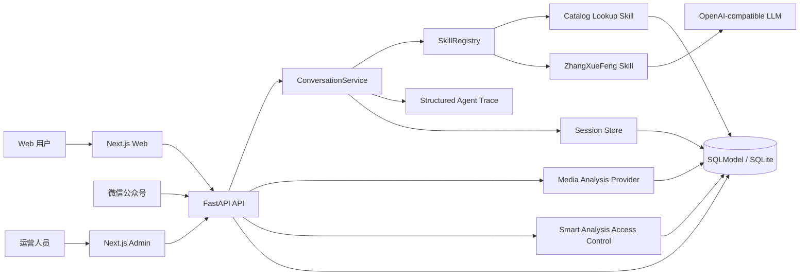

# 高考填志愿.agent 项目评审

> 评审日期：2026-08-25
> 评审基线：`main` / `772948a`
> 评审方式：仓库静态阅读与配置核对；本地可执行验证结果独立记录在 `docs/verification/`，本轮未调用外部模型或部署生产环境。

## 结论

这是一个已经跨过“聊天页面 + 单次模型调用”阶段的垂直领域 AI Agent 应用雏形。项目把结构化高考目录、可插拔 Skill、OpenAI-compatible Provider、确定性降级、用户权益、微信公众号适配、内容运营后台和交付脚本连接成了一条完整产品链路。

它目前最适合作为“有真实业务约束的 LLM 应用工程项目”展示，而不是宣称为已完成生产验证的招生决策系统。面试价值主要来自工程取舍、异常治理、多渠道接入、会话生命周期和运营闭环；当前工作树已补入轻量调用 trace、最小会话持久化、离线评测基线、版本指纹和 SQL 覆盖边界 spike，后续仍应优先补齐账号级身份生命周期和可追溯的生产发布验证。

## 评审范围

评审覆盖 `git ls-files` 返回的 256 个跟踪文件，并额外核对了当前工作区未提交内容：

- FastAPI 后端、SQLModel 模型、服务层、路由、Alembic、26 个后端测试模块和 1 个测试辅助文件。
- Next.js App Router 页面、组件、API 边界、Server Actions、28 个前端测试模块和 1 个测试辅助文件。
- GitHub Actions、Docker、PowerShell 脚本、Linux/Windows 部署模板与运维手册。
- JSON 演示数据、48 份历史设计规格和 53 份历史实施计划。
- README、环境变量示例、忽略规则和当前 Git 状态。

未读取真实 `.env`，未输出任何本地凭据，也未向外部服务发送仓库内容。

## 系统架构



### 后端边界

- [`apps/api/app/main.py`](apps/api/app/main.py) 负责应用生命周期、CORS 和四组路由挂载。
- [`apps/api/app/routers`](apps/api/app/routers) 提供公开目录、平台权益、聊天/微信公众号和管理接口。
- [`apps/api/app/services`](apps/api/app/services) 承载 Skill 路由、LLM Provider、媒体分析、权益、发布和内容运营逻辑。
- [`apps/api/app/models`](apps/api/app/models) 定义学校、专业、榜单参考、内容版本、权益、审核队列和媒体事件等关系模型。
- [`apps/api/app/scripts/seed_catalog.py`](apps/api/app/scripts/seed_catalog.py) 将 JSON 演示资产播种到关系数据库。

### 前端边界

- [`apps/web/app`](apps/web/app) 包含公开首页、学校/专业详情、聊天和后台入口。
- [`apps/web/components/public`](apps/web/components/public) 负责搜索、聊天、平台权益和榜单解释。
- [`apps/web/components/admin`](apps/web/components/admin) 提供内容治理、审核、轮换、媒体事件和智能分析运营界面。
- [`apps/web/lib`](apps/web/lib) 集中处理 API 调用、DTO 映射和管理端 token 请求头。

### 交付边界

- [`scripts`](scripts) 提供启停、项目校验、本地链路与微信公众号 AES 冒烟入口。
- [`.github/workflows/ci.yml`](.github/workflows/ci.yml) 覆盖 API lint/test、迁移冒烟、Web lint/test/build 和 Docker 构建。
- [`docker-compose.yml`](docker-compose.yml)、[`deploy/linux`](deploy/linux) 与 [`deploy/windows`](deploy/windows) 提供多种运行模板。

## Agent 与 LLM 能力评估

| 能力 | 已有实现 | 证据 | 面试价值 |
|---|---|---|---|
| Skill 注册与路由 | `catalog_lookup` 与 `zhangxuefeng` 两类 Skill；按置信度选择 | [`skills.py`](apps/api/app/services/skills.py)、[`chat.py`](apps/api/app/services/chat.py) | 可讲解工具选择、阈值与澄清回退 |
| 结构化模型输出 | OpenAI-compatible Chat Completions，要求 JSON object | [`llm.py`](apps/api/app/services/llm.py) | 体现 Provider 抽象与输出协议治理 |
| 确定性降级 | 配置缺失、请求失败、余额不足、格式错误均回退到规则结果 | [`skills.py`](apps/api/app/services/skills.py) | 体现 LLM 非确定性下的可用性设计 |
| Agent trace | 记录候选/选择 Skill、版本、Prompt SHA-256 指纹、Provider、模型调用标记、耗时和降级原因；session 仅保存摘要引用 | [`tracing.py`](apps/api/app/services/tracing.py)、[`chat.py`](apps/api/app/services/chat.py) | 可解释一次请求为什么这样路由，且不把敏感原文写入 trace |
| 会话生命周期 | 保存 user/assistant 消息，30 天滚动过期，按用户读取/删除；页面可通过 `session_id` 恢复 | [`chat_sessions.py`](apps/api/app/services/chat_sessions.py)、[`chat.py`](apps/api/app/services/chat.py) | 可展开数据保留、隔离和“短期会话不等于长期记忆”的取舍 |
| 离线评测基线 | 9 个固定样本，覆盖目录、路由、Provider 失败和结构化输出；当前 9/9 通过 | [`cases.json`](apps/api/evals/cases.json)、[`runner.py`](apps/api/app/evals/runner.py) | 可量化讲解“模型不可用时如何保持可用”，不伪造线上质量 |
| 权益控制 | `off / gated / on`，支持持久化用户权益 | [`access_control.py`](apps/api/app/services/access_control.py) | 体现模型成本与商业权限结合 |
| 多模态预留 | 图片分析 Provider、字段提取、审计事件和重试入口 | [`media_analysis.py`](apps/api/app/services/media_analysis.py) | 可说明多模态链路及失败可恢复性 |
| 多渠道适配 | Web、通用微信渠道、公众号明文/AES 回调 | [`routers/chat.py`](apps/api/app/routers/chat.py) | 展示渠道协议适配能力 |
| 人工运营闭环 | 审核队列、内容版本、精选轮换、榜单参考和媒体事件后台 | [`routers/admin.py`](apps/api/app/routers/admin.py) | 说明 Agent 不只是一条模型调用链 |

### 典型聊天执行流

```text
用户消息
  -> 请求归一化
  -> 读取服务端智能分析模式与用户权益
  -> 自动入口：SkillRegistry 按置信度匹配
     或直接入口：获取请求指定的 Skill
  -> 目录 Skill 或高考咨询 LLM Skill
   -> 结构化结果校验
   -> 成功结果 / 规则降级结果
   -> 以服务端解析的主体 + session_id 保存消息并返回 session_id
   -> Web 或微信公众号适配输出
```

`POST /api/chat/messages` 和渠道适配器使用自动匹配；当前 Web 聊天页调用 `POST /api/chat/skills/zhangxuefeng/invoke`，走指定 Skill 的直接调用路径。两条路径都复用 `ConversationService`、服务端模式/权益读取和统一输出结构。

## 工程亮点

### 1. LLM 是增强层，不是单点依赖

未配置模型或 Provider 失败时，基础目录问答仍能返回可解释结果。这比把所有请求直接转发给模型更适合面试展示，因为它体现了对成本、稳定性和外部依赖的主动管理。

### 2. 领域数据使用结构化模型

学校、专业、榜单来源、关联关系和精选规则使用 SQLModel 表达，而不是全部塞入 Prompt。当前数据规模很小，但边界清晰；6 个固定样本的 SQL 覆盖 spike 得到 `33.33%` 覆盖率与 `100%` 标签一致率，当前没有引入向量数据库的量化必要性。

### 3. 具备运营与审计思维

内容审核、版本状态、失败原因、媒体事件、重试入口和智能分析开关形成了人工治理面。这是本项目区别于普通聊天 Demo 的核心优势。

### 4. 测试覆盖业务路径而非只测健康检查

源码静态统计包含 194 个后端测试函数；pytest 当前收集并通过 205 个后端用例（含参数化展开），另有 129 个前端 `test/it` 用例。测试覆盖 Skill 路由、LLM 错误、公众号 AES、内容不变量、后台筛选、会话隔离、离线评测、检索边界、权益扩权回归、可信身份、平台权益主体、公众号重放、URL/媒体输入安全、隐私删除、Action 状态、版本探针和页面交互。源码函数数与参数化后的用例数分开记录，避免把两者混为一谈。

### 5. 有可复现交付意识

仓库已经包含 CI、Docker 镜像构建、Compose、PowerShell、systemd、nginx 和交接文档。当前工作树已收紧发布门禁与生产 Web API 地址策略，但实际 GitHub Release、Docker daemon 构建、发布后 smoke、监控告警和自动回滚仍未演练。

## 主要缺口与风险

以下结论来自静态代码审查。除“当前脚本变量未定义”可由语法路径直接判断外，其余风险尚未通过攻击测试、端到端测试或生产流量复现。

| 优先级 | 发现 | 影响 | 建议验证与改进 |
|---|---|---|---|
| P0 | Phase 4.1 前客户端 metadata 中的 `entitlements` 会与数据库权益合并，且可提供 `smart_analysis_mode` | 修复前可能绕过智能分析权益边界 | 当前工作树已改为只信任服务端模式/数据库权益，并有服务层与 API 回归；Phase 4.2 已进一步建立聊天主体边界 |
| P1 | 平台权益查询已复用服务端主体，但账号注册、撤销和长期会话管理尚未实现 | guest session 不是账号认证，令牌泄露后没有账号级撤销语义 | 后续补账号/撤销策略；保留 Phase 4.2—4.3 的 token subject、claim mismatch 和查询主体回归 |
| P0 | 评审快照中的 `smoke-local-stack.ps1` 曾在严格模式下使用未初始化 `$repoRoot` | 修复前本地冒烟会在探针开始前失败 | 当前工作树已恢复初始化；同一 `-DryRun` 与使用示例配置的真实 API/Web/微信 smoke 均已退出码 0 |
| P0 | 原 Release 中的 `ci-pass` 仅执行提示性 `echo` | 基线 Tag 发布没有真实质量门禁 | 当前工作树已改为复用同一 commit 的 CI workflow；尚待 GitHub tag 实际触发验证 |
| P1（已缓解） | 公众号验签曾没有时间窗、nonce/MsgId 去重和请求限制 | 修复前存在重放和资源滥用风险；当前仍未覆盖速率限制/WAF | 当前工作树已加入 timestamp 窗口、body 上限和持久化幂等 receipt；后续补速率限制与高并发演练 |
| P1（部分缓解） | 学校图片建议和媒体分析会访问外部 URL | 常见协议、凭据、本地/保留地址、危险重定向和超限 HTML 已被阻断；DNS rebinding、媒体 MIME/内容校验和隐私策略仍有边界 | 保留统一 URL 校验、逐跳重定向校验和 1 MiB 响应上限；后续补受控域名/解析绑定、媒体类型校验和隐私策略 |
| P1 | 当前身份是可签发的匿名 guest session，尚无账号绑定、撤销和多设备管理 | 令牌泄露或长期有效时无法按账号维度主动失效 | 增加账号/会话存储与撤销策略；保留当前错误主体统一 404 的回归测试 |
| P1（部分缓解） | trace 生命周期和外部日志清理仍依赖部署环境 | 当前已明确 trace 不落库、7 天轮转策略，并对会话/媒体/receipt 做启动与请求路径清理；journald/容器日志删除尚未由应用自动配置 | 在生产部署中配置 journald/容器 log rotation；后续再评估统一调度器 |
| P1（已缓解） | Web 后台写操作普遍吞掉异常 | 修复前运营人员无法判断保存是否成功 | 当前 Action 返回结构化 `{ ok, message }`，表单显示提交中和失败原因；继续补全端到端交互演练 |
| P2（部分缓解） | 后台页面和 dashboard shell 体积较大 | 理解和回归成本继续上升 | 内容质量表单已独立；按审核、媒体和轮换继续渐进拆分 |

## 文档与交付准确性问题

1. 原 README 将 `data/` 描述为 SQLite 数据目录，但跟踪内容实际是 JSON 演示资产；运行时 SQLite 文件被忽略。
2. 原 README 的测试通过数、构建和审计结果没有日期与 commit，不能当作当前验证事实；当前验证结果单独记录在 `docs/verification/`。
3. Python 运行时文档已统一为 3.11+；CI、API Dockerfile 和 `pyproject.toml` 均以 Python 3.11 作为最低基线。
4. Release Web 镜像原先默认把浏览器 API 地址构建为 `http://localhost:8000`；当前工作树已要求生产 Environment 显式提供 API 根地址，并让 Dockerfile/Compose 在构建时校验该值。
5. 根目录 `data/` 已被播种脚本、测试和校验器定义为权威源；未跟踪的 `apps/data/` 当前内容相同但仍会产生未来漂移风险，尚未擅自删除。
6. Phase 3.1 已新增 `AgentTraceRecorder`；默认只写结构化日志，不持久化消息、Prompt、API Key、openid 或用户 ID 原值，详细 schema 见 [`agent-trace-design.md`](docs/superpowers/specs/2026-08-25-agent-trace-design.md)。
7. Phase 3.2 已新增 `ChatSession`/`ChatMessage`、Alembic 迁移和按用户读取/删除接口；消息默认 30 天滚动保留，页面支持用 `session_id` 恢复展示，详细设计见 [`chat-session-persistence-design.md`](docs/superpowers/specs/2026-08-25-chat-session-persistence-design.md)。
8. Phase 3.3—3.5 已新增 9 个固定离线评测样本、Provider stub、路由/schema/fallback 指标和报告；当前 9/9 通过，详细结果见 [`2026-08-25-phase3.3-3.5-evaluation.md`](docs/verification/2026-08-25-phase3.3-3.5-evaluation.md)。
9. Phase 3.6 已把 Skill 版本和 Prompt SHA-256 指纹写入内部 trace 与离线报告，公开响应不增加指纹字段；当前离线 Prompt 指纹为 `a3878eba6f5686813ee17d933622d9e4e7a18156beb03588a90071fe7f655e43`。
10. Phase 3.7 已用 6 个固定样本测量 SQL catalog 边界：实际/期望覆盖率均为 `33.33%`，标签一致率 `100%`，因此保持 SQL-first，暂不引入向量依赖；详细报告见 [`2026-08-25-phase3.7-retrieval-spike.md`](docs/verification/2026-08-25-phase3.7-retrieval-spike.md)。
11. Phase 4.1 已阻断客户端 metadata 伪造智能分析模式和权益；离线 runner 也改为显式播种临时数据库策略，详细验证见 [`2026-08-25-phase4.1-verification.md`](docs/verification/2026-08-25-phase4.1-verification.md)。
12. Phase 4.2 已新增标准库 HMAC 签发的 guest session、HTTP-only cookie 和 Bearer 解析；生产-like 环境不再接受无令牌的裸 `user_id`/通用 `openid`，Web 也不再把 URL 身份提示提交给 API。开发/测试显式主体回退、账号认证和微信重放仍是后续边界，详细验证见 [`2026-08-25-phase4.2-verification.md`](docs/verification/2026-08-25-phase4.2-verification.md)。
13. Phase 4.3 已让 `/api/platform/entitlements/evaluate` 使用服务端解析的主体读取持久化权益；公共产品包预览仍由 `product_slugs` 驱动，Web 不再发送 `user_id`/`openid`。账号级认证和令牌撤销仍未完成，详细验证见 [`2026-08-25-phase4.3-verification.md`](docs/verification/2026-08-25-phase4.3-verification.md)。
14. Phase 4.4 已为公众号 GET/POST 明文和 AES 路径加入 timestamp freshness window、256 KiB 默认 body 上限，以及基于 MsgId/nonce 的持久化 receipt claim；重复回调返回 `success` 且不重复进入业务处理。速率限制、WAF 和高并发分布式演练仍未完成，详细验证见 [`2026-08-25-phase4.4-verification.md`](docs/verification/2026-08-25-phase4.4-verification.md)。
15. Phase 4.5 已把外部 URL 校验集中到 [`url_safety.py`](apps/api/app/services/url_safety.py)：只允许 HTTP(S)，拒绝凭据、本地/保留主机、危险重定向和超过 1 MiB 的官网响应；微信图片、管理员媒体重试和官网图片候选共用边界，详细验证见 [`2026-08-25-phase4.5-verification.md`](docs/verification/2026-08-25-phase4.5-verification.md)。DNS rebinding、媒体 MIME/内容校验和速率限制仍是后续工作。
16. Phase 4.6 已明确会话、媒体事件、replay receipt 和 Agent trace 的数据生命周期：SQLite 记录按配置清理，默认会话/媒体保留 30 天，receipt 默认保留 300 秒；`DELETE /api/privacy/me` 按服务端主体删除个人会话、消息和媒体事件，trace 继续只写脱敏 logger。账号级 token 撤销、备份擦除和外部日志轮转配置仍待后续阶段，详细验证见 [`2026-08-25-phase4.6-verification.md`](docs/verification/2026-08-25-phase4.6-verification.md)。
17. Phase 4.7—4.9 已完成后台写操作状态、首页并发读取和首批渐进拆分：Action 返回结构化 `{ ok, message }`，`useActionState` 在对应表单显示失败原因；后台独立请求使用 `Promise.allSettled` 保留分区降级；摘要/正文/相关推荐/榜单表单已移动到独立组件。详细验证见 [`2026-08-25-phase4.7-4.9-verification.md`](docs/verification/2026-08-25-phase4.7-4.9-verification.md)。

## 面试展示建议

### 推荐主叙事

> 我没有把垂直咨询做成单纯 Prompt Demo，而是把结构化领域数据、Skill 路由、模型增强、失败降级、权限控制、微信公众号和人工运营后台组合成可交付的 Agent 应用；模型不可用时基础服务仍然可用，风险和失败也能够被记录和运营。

### 三个重点展开问题

1. **为什么不用全量 RAG？** 当前学校和专业关系高度结构化，SQL 查询更确定、可测试、成本更低；6 个固定样本的覆盖 spike 没有发现立即引入向量检索的证据，后续会先用更多真实非结构化样本验证。
2. **如何处理模型不可靠？** 约束 JSON 输出、区分配置/网络/余额/格式错误、保留规则降级，并用 trace 记录 Provider、模型调用标记和降级原因；9 个固定离线样本已验证主要路由和降级路径。
3. **如何把 Agent 放进真实业务？** 通过用户权益、内容审核、媒体事件、微信公众号协议和运营后台，把模型能力放进受控产品链路。

## 成熟度评分

| 维度 | 当前判断 | 说明 |
|---|---|---|
| 业务闭环 | 4/5 | 公开内容、聊天、微信和后台链路齐全 |
| Agent/LLM 工程 | 4/5 | 有 Skill、Provider、降级、请求 trace、短期会话恢复、离线评测、版本指纹、SQL 覆盖 spike 和 guest session；trace 外部日志轮转仍依赖部署 |
| 测试工程 | 4/5 | 测试资产丰富且已有可追溯运行结果与覆盖率基线；仍缺覆盖率门槛和 E2E |
| 安全与身份 | 3/5 | 已阻断客户端 metadata 直接扩权，为聊天/会话/平台权益建立签名 guest session 主体，为公众号增加基础重放防护，收紧 URL/媒体输入并建立隐私删除/保留策略；账号认证、DNS rebinding、速率限制、MIME 和外部日志轮转仍未完成 |
| 交付与运维 | 3/5 | CI、镜像和模板完整；发布门禁与生产闭环不足 |
| 面试展示 | 3/5 | 本地脱敏截图、测试指标、三分钟脚本、问答包、约 2.2 分钟视频候选和旁挂 WebVTT 字幕已补齐；画面复核已完成，但候选无音轨，旁白与生产演示仍待补充 |

## 下一步

完整路线图与验收标准见 [`PLAN.md`](PLAN.md)。第一阶段只做文档和展示增强；当前已完成 Phase 3.1—3.7、Phase 4.1—4.9、Phase 5.1—5.4、Phase 5.6、Phase 5.8，并完成 Phase 5.5 的本地 smoke/版本断言与 Phase 5.7 的 Demo 脚本/录制清单、后台展示样式、本地脱敏视频候选和旁挂字幕，新增内容均沿用现有 API/SQLModel/前端测试边界，没有删除功能或引入运行时依赖；生产发布后 smoke、生产版本核对、回滚和视频旁白仍待外部环境或录制条件。
