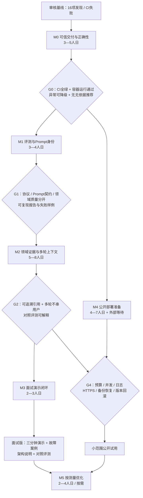

# 项目优化路线图 Implementation Plan

> **For agentic workers:** REQUIRED SUB-SKILL: Use superpowers:subagent-driven-development (recommended) or superpowers:executing-plans to implement this plan task-by-task. Steps use checkbox (`- [ ]`) syntax for tracking.

**Goal:** 以可验证的代码、评测和演示，将项目打磨成适合 AI Agent / LLM 应用面试的代表作，并单独建立公开部署门槛。

**Architecture:** 保留 FastAPI + SQLModel + Next.js + SkillRegistry。先修复交付与协议缺陷，再建设“受控会话上下文 → SQL 证据 → 模型解释 → 契约与引用校验 → 评测”的闭环。生产就绪工作独立验收，不用本地测试代替生产证据。

**Tech Stack:** 现有 Python 3.11+、Pydantic、httpx、pytest、Next.js、Vitest、SQLite/Alembic、GitHub Actions、Docker；浏览器 E2E 仅作为开发验证工具。

**Spec:** [2026-09-08 深度审核](../../reviews/2026-09-08-deep-audit.md)，基线 4f9d87a。

## Global Constraints

- 不大规模重构、不删除现有业务功能、不引入重型运行时依赖。
- 保留现有 Skill 路由和 API 顶层响应契约；内部响应验证可逐步收紧。
- 真实密钥仅由私有运行配置提供，不进入 Git、报告、Prompt、截图。
- 演示数据不能作为真实招生依据；未经评测不得宣称回答准确率或录取概率。
- 本地未跟踪 apps/data/ 保留，不暂存。
- 本计划既作为执行清单也作为验收记录；已完成项必须附带可复现证据，未完成项不得提前宣称通过。
- 人日为单名熟悉项目的开发者净工作量估算，不含外部数据授权、生产环境等待和用户验收。

## 计划图：依赖关系与验收门



M4 可在 M1/M2 期间并行推进；它仍必须通过 G4 才能开放真实流量。G0 不满足则先修复，不把故障带入后续功能开发。

## 当前执行状态（2026-09-16）

| 任务 | 状态 | 已执行内容 | 尚缺证据 |
|---|---|---|---|
| T01 | 已完成 | CI 使用项目 `.[dev]` 依赖；统一 Ruff lint/format；本地门禁已纳入 `verify-project.ps1`；GitHub CI run `34759370307` 的 API Lint & Format 通过 | 无 |
| T02 | 代码完成，运行时待验证 | 镜像复制正式 `skills/`；Compose 传入 session secret；启动播种改为仅空库初始化，已有库重启不覆盖；同一 CI run 的 Docker Build 通过 | Docker Desktop 恢复后做隔离卷 smoke、重启保留摘要、Prompt hash、/health、/version 和 stub 调用 |
| T03 | 已完成 | Provider 信封显式校验；Skill 输出 Pydantic 严格契约；非法意图/字段降级；旧宽松 JSON 兼容路径保留；GitHub CI 同 SHA 的 API Test 通过 | 无 |
| T04 | 已完成 | 缺少分数/位次时不生成量化院校建议；返回 `insufficient_candidate_context`；离线评测新增风险标记断言 | 已在 T06 领域样本中扩展缺信息场景 |
| G0 | 条件通过，待运行时封板 | API/Web 本地回归、离线评测、GitHub required checks 与 Docker Build 已通过 | 本机 Docker runtime smoke；完成后才进入 M1 |
| T05 | 已完成 | `PromptSnapshot` 统一运行时/评测实际 system message；支持 `--prompt`、缺文件非零退出；报告记录两类 hash、数据集 hash、commit/dirty/mode；兼容链接已修复 | 无 |
| T06 | replay 已完成，真实质量待补 | 工程协议样本 30 条；领域合成 replay 40 条，分类与 dev/holdout 分离；质量报告记录分母、失败样例、模型/成本占位；Prompt 契约测试捕获 actual messages | 真实模型小样本、token/成本统计和线上质量基线；当前 `real` 模式带预算也明确不执行 Provider |
| T07 | demo scope 已完成，别名与 miss 统计待补 | 新增有限 SQL 证据包；支持精确 slug/名称、关键词、地区、精确年份和条数/字符预算；来源 URL、未知实体、过期 provenance 有回归测试；数据状态继承 `demo` 边界 | 维护别名映射并测量 miss；真实招生数据仍需来源许可、更新时间和负责人 |
| T08 | 代码完成，浏览器/E2E 与真实模型待补 | 服务端从已授权 session 读取最近最多 6 轮、总计 12000 字符的完整 user/assistant turn；忽略客户端伪造历史；后续明确更正优先；Web 成功后追加当前 exchange；定向 API 55 项、Web 聊天 9 项通过 | 浏览器两轮恢复与重复提交 E2E；真实 Provider 的小样本上下文质量、token/cost 仍待受控环境确认 |
| T09 | 代码与 replay 完成，真实模型/浏览器展示待补 | 明确实体的受限 SQL 证据包；嵌套 citation 白名单；无证据数字声明降级；直接调用 vs 上下文+证据+校验共享预算、共享评分并记录实际返回模型；API 250 项通过、成对 replay 1/1 可比 | 真实 Provider 成对样本、token/cost、引用展示/打开的浏览器 E2E；当前证据资产仍是 demo |
| T10 | 已完成，真实模型质量仍待补 | 新增 `latest.json` 唯一验证索引和 T10 浏览器验收记录；Web 增加服务端证据引用卡片；本地 Playwright 覆盖首页、目录详情、证据展示、两轮会话、`session_id` 恢复、Provider 失败降级和后台摘要保存；生成脱敏截图与视频候选；API 251 项、Web 132 项通过 | 真实 Provider 成对质量、token/cost、Docker runtime 和生产发布仍待外部环境 |
| T11 | 代码完成，单进程本地验证 | 新增消息 4000 字符上限、模型并发 4、30 秒总时限、IP/主体窗口限流、跨匿名身份 UTC 日预算、瞬时 Provider 最多一次重试；trace 在持久化成功/失败后只发一次并保留 `usage=null` 边界；API 261 项通过 | 多 worker 共享预算、真实 Provider token/cost、Docker runtime、外部日志轮转和生产发布 |
| G1 | replay 条件通过 | 三层评测已分离并可复现：协议 `30/30`，Prompt 契约测试通过，领域 replay `40/40` | 不能用 replay 结果替代真实模型质量；需补真实受控评测后再封板 |

## 总计划表

| 里程碑 | 任务 | 优先级 | 依赖 | 估算 | 对应审核 | 验收产物 |
|---|---|---|---|---|---|---|
| M0 | T01 CI 与本地门禁统一 | P0 | 无 | 0.5—1日 | A01 | 同一 SHA 全部 required checks 通过 |
| M0 | T02 容器资产、生产配置与播种 | P0 | T01 | 1—1.5日 | A02/A03/A07 | 隔离容器 smoke、重启保留数据 |
| M0 | T03 Provider 和输出强契约 | P0 | 无 | 1—1.5日 | A04/A05 | 异常矩阵、动作校验回归 |
| M0 | T04 规则降级证据边界 | P0 | T03 | 0.5—1日 | A06 | 信息不足不生成量化推荐 |
| M1 | T05 Prompt 快照与报告溯源 | P1 | T03 | 1—1.5日 | A09/A16 | 显式路径、有效消息 hash、有效 Markdown |
| M1 | T06 三层评测基线 | P1 | T04/T05 | 2—2.5日 | A08 | 协议回归、Prompt契约、领域质量三份结果 |
| M2 | T07 有限数据与来源检索 | P1 | T06 | 2—3日 | A10 | 可引用的 SQL 证据包 |
| M2 | T08 受控多轮与会话展示 | P1 | T03/T06 | 2—3日 | A11 | 两轮追问、改口、隔离、恢复 |
| M2 | T09 证据驱动回答与对照评测 | P1 | T07/T08 | 1—2日 | A10/A08 | 相同模型下的成对评测 |
| M3 | T10 面试演示与文档统一 | P1 | T09 | 2—3日 | A16 | 三分钟 Demo、故障演示、证据索引 |
| M4 | T11 请求预算与运行观测 | P1/公开前 | T03 | 1.5—2.5日 | A12/A13 | 限流/并发/usage/最终状态 trace |
| M4 | T12 渠道与外链边界 | P1/公开前 | T11 | 1—2日 | A14 | 微信并发及受控出站检查 |
| M4 | T13 生产发布演练 | P1/公开前 | T02/T11/T12 | 1.5—2.5日 | A15/A03 | HTTPS smoke、备份恢复、回滚证据 |
| M5 | T14 按证据优化性能与结构 | P2 | M2；按需 | 2—4日 | A15 | 数据规模/并发基线与优化前后比较 |

面试版主线 M0→M1→M2→M3 估算 13—20 人日，约 3—4 个工作周。数据来源不足时，应缩小演示问题集合，不能用补造数据满足排期。公开试用另需 M4；不把 M5 放在面试版关键路径上。

## M0：首先让交付与行为可信

### T01 — 统一 CI 与本地检查

**文件：** 修改 `.github/workflows/ci.yml`、`apps/api/pyproject.toml`、`scripts/verify-project.ps1`；formatter 涉及文件单独机械提交。
**接口：** 无业务接口变化；本地检查和 CI 读取同一版本约束，默认采用 Ruff format 作为唯一 formatter。

- [x] 保存当前 Ruff/Black 失败清单，复核 PR #1 的最新检查。
- [x] 在 CI 使用受项目约束的开发依赖；去掉重复 Black 门禁，保留 Ruff lint/format。
- [x] 执行下面命令并审阅仅格式化的差异。
- [x] 将同样的 lint/format 命令纳入 verify-project；提交后检查已有 PR 的同 SHA 结果，不能只看 push 成功。

```powershell
Set-Location apps/api
.\.venv\Scripts\python.exe -m ruff format .
.\.venv\Scripts\python.exe -m ruff check .
.\.venv\Scripts\python.exe -m ruff format --check .
.\.venv\Scripts\python.exe -m pytest -q
```

### T02 — 验证容器实际运行

**文件：** 修改 `apps/api/Dockerfile`、`docker-compose.yml`、`apps/api/app/scripts/seed_catalog.py`；新增 `scripts/tests/test-container-runtime.ps1`。
**接口：** 容器内正式 Prompt 位于 `/app/skills/zhangxuefeng/SKILL.md`；生产接收 `GAOKAO_AGENT_SESSION_SECRET`；播种成为显式演示初始化步骤。

- [ ] 在临时卷验证当前容器缺失 Prompt；用合成配置验证 production 启动，禁止使用真实数据卷。
- [x] 加入 `COPY skills ./skills`，Compose 显式映射 session secret。
- [x] 默认服务启动仅在空库初始化演示数据；已有库重启不重复覆盖，强制重灌仍保留手动 `seed_catalog` 命令。
- [ ] 在测试容器修改学校摘要，重启，确认摘要保留；验证 Prompt 非空 hash、迁移、/health、/version 和 stub 调用。
- [ ] 将容器运行 smoke 纳入 CI 的构建后验证；不只检查 /health。

### T03 — Provider 信封和业务输出契约

**文件：** 修改 `apps/api/app/services/llm.py`、`skills.py`、`apps/api/tests/test_llm_provider.py`、`test_chat_services.py`；新增 `apps/api/app/schemas/skill_output.py` 及包初始化文件。
**接口：** 保留 `complete_text(messages=...) -> str`；协议错误统一为 ProviderResponseFormatError；Skill 输出保持九个现有顶层字段。

- [x] 参数化 mock 响应覆盖非 JSON、顶层数组、空 choices、message=null、content 非字符串、错误响应体非对象。
- [x] 先复现当前 IndexError/AttributeError，再用显式 isinstance/长度检查归一化协议错误。
- [x] 以 Pydantic strict 模型定义 intent Literal、summary/analysis/rendered_reply 字符串、entities 对象、四类数组和嵌套项目。
- [x] 将 actions 限制为已知内部资源动作，拒绝未知协议和外部跳转；为旧 Provider 兼容补默认值时保留明确 normalization 标记。
- [x] 验证非法意图、数字 summary、字符串 actions 被降级，合法现有响应仍可用。

```python
# 回归测试核心断言；完整 fixture 使用现有 fake provider 和 ChatRequestContext。
assert result.debug_notes == ["provider_invalid_response"]
assert result.model_called is True
assert isinstance(result.actions, list)
```

### T04 — 缺信息时的规则降级

**文件：** 修改 `skills.py`、`test_chat_services.py`、`apps/api/evals/cases.json`。
**接口：** 沿用现有输出字段；信息缺失返回 risk_flags 与最多三条 follow_up_questions。

- [x] 对仅“江苏985”、缺年份、缺位次的请求建立失败回归；断言不产生冲刺院校或 confidence 数值。
- [x] 保留普通院校介绍与比较功能，个人推荐需要明确证据；规则分支和 Prompt 分支使用一致的信息不足标识。
- [x] 回归自动路由、direct、微信通道；评测期望更新应说明行为变化，不为凑通过率修改断言。

G0：T01—T04 全部通过；API/Web/Docker 原有功能仍可使用。公开流量仍需 M4。

## M1：让评测真正说明问题

### T05 — 完整 Prompt 身份

**文件：** 修改 `prompt_assets.py`、`config.py`、`skills.py`、`app/evals/runner.py`、`test_eval_runner.py`、`evals/offline-prompt.md`。
**接口：** 新增不可变 PromptSnapshot(path, asset_sha256, effective_sha256, system_text)；同一快照用于发给 Provider 和记录身份；CLI 增加 --prompt，未设置时默认项目资产。

- [x] 用捕获 messages 的 fake provider 断言实际发送 system_text；自定义路径和缺文件也测试。
- [x] 将固定 system 附加指令与资产组装集中处理；effective hash 覆盖完整 system_text。
- [x] 报告写入路径、两类 hash、数据集 hash、commit/dirty、评测模式；缺文件直接非零退出。
- [x] 修复兼容说明链接与 Markdown 表头；保持报告级身份与实际使用快照一致。

### T06 — 分离三层评测

**文件：** 修改 `app/evals/runner.py`、`evals/cases.json`；新增 `evals/domain-cases.json`、`app/evals/quality_runner.py`、`tests/test_quality_runner.py`。
**接口：** 协议回归继续默认离线；质量 runner 读取固定输入、必需证据与 rubric，默认 replay；真实模式必须显式参数开启并设置请求/token 预算。

- [x] 工程回归扩充为 30 个确定性场景，覆盖 T03/T04 异常、缺信息、权益隔离和敏感/动作边界。
- [x] Prompt 契约使用捕获 Provider 验证资产、角色和用户上下文真正传入；质量 replay 与 Prompt 契约分离，不把 stub 输出作为 Prompt 质量证明。来源证据包留待 T07。
- [x] 初始 40 条合成领域问题：信息不足8、引用问答8、比较6、多轮6、对抗6、域外6；每条带预期证据/禁用断言/评分规则，区分开发集与留出集。
- [x] 质量指标包括引用正确性、无证据数字、必需信息追问、类型契约、模型与成本占位；报告失败案例及样本分母。
- [ ] 真实模型先做小样本基线，预算不足时停止并标记未完成；不以 LLM judge 单独作为事实判定。

G1 建议验收目标（是目标，不是当前成绩）：工程回归100%；质量留出集零虚构录取数字；所有引用可回溯；缺信息追问覆盖率≥95%。模型质量若未达到门槛，记录失败分布并迭代，不宣称通过。

## M2：构建面试最有价值的领域闭环

### T07 — 有限 SQL 证据包

**文件：** 新增 `apps/api/app/services/evidence.py`、`apps/api/tests/test_evidence.py`；修改 `data/README.md`、`scripts/verify-data-assets.py`。
**接口：** EvidenceItem(id, source_url, source_name, year, province, text, data_status)，返回有条数与长度上限的列表。

- [x] 从现有演示数据开始，限定支持的学校/专业与问题；示例数据标记 demo。
- [x] 校验来源字段、年份/地区过滤、找不到/过期证据、未知 entity 等场景。
- [x] 当前不引入真实招生数据；数据 README 明确来源许可、更新时间和负责人是发布前门槛，只展示目录与比较能力。
- [x] 从精确 slug/名称和 SQL 过滤开始；不直接引入向量检索。
- [ ] 在获得代表性输入集后补维护别名映射并测量 entity miss，不用 demo 数据推导线上召回率。

### T08 — 受控多轮上下文

**文件：** 修改 `chat.py`、`chat_sessions.py`、`skills.py`、`chat-workspace.tsx`、`test_chat_sessions.py`、`apps/web/tests/chat-workspace.test.tsx`。
**接口：** 历史按服务端主体读取；最多最近6轮、总计12000字符（初始可配置值）；用户改口覆盖旧信息。

- [x] 测试先说省份分数、再补选科；改口；不同用户访问；过期；超长历史裁剪。
- [x] 从已授权 session 获取上下文并传给 Skill；不把历史助手文本升级为系统指令。
- [x] 前端成功后追加当前 user/assistant，维持 session 链接与重新加载一致；重复提交保留明确的提交中状态。
- [x] 用 spy provider 验证实际上下文，前端测试验证当前轮和历史区都显示。

本轮仅完成 T08 的代码与本地回归边界；没有把 fake Provider 的上下文拼接测试表述为真实模型质量证明，也没有把前端单元测试表述为浏览器 E2E。

### T09 — 证据驱动回答与对照

**文件：** 修改 `skills.py`、输出 schema、`quality_runner.py`；新增 `tests/test_grounded_answers.py`。
**接口：** 引用放在现有嵌套结果中并保持顶层契约；citation id 必须属于本次 EvidenceItem 集合。

- [x] 注入限定大小的证据包，验证未知 citation、无来源数字、没有证据时的行为。
- [x] 使用同一问题对比“当前用户问题直接调用”与“上下文+证据+校验”；记录请求模型与 Provider 返回模型，路由别名不能当固定模型版本。
- [x] 两组共享预算、样本和评分；按样本发布优劣与失败原因，不保证增强方案必然获胜。

G2：代码与 replay 条件具备；运行时输出附带服务端证据元数据，含可用来源 URL 时可打开；真实模型、多轮关键场景和浏览器引用展示仍需外部环境验收。

## M3：面试交付

### T10 — 三分钟 Demo 与唯一证据索引

**文件：** 修改 README、PROJECT_REVIEW、`docs/interview/three-minute-demo.md`、`interview-qa.md`、`test_documentation_consistency.py`；新增 `docs/verification/latest.json`。

- [x] latest.json 记录验证日期、SHA、模式、报告路径与测试结果；文档链接到它或其对应报告，历史数字保留日期。
- [x] 演示“目录证据 → 两轮追问 → 引用解释 → Provider故障降级 → trace/评测”。
- [x] 覆盖首页、聊天、会话恢复、后台一次保存的浏览器 E2E；录制脱敏三分钟视频候选。
- [x] 面试问答给出一个真实修复案例、一个质量失败样例、一次明确的技术取舍；说明离线指标的含义。

## M4：公开部署门槛

### T11 — 请求预算和可观测性

**文件：** 修改 `config.py`、`routers/chat.py`、`llm.py`、`tracing.py`、`main.py`；新增 `tests/test_request_budget.py`。
- [x] 初始限制：消息4000字符、全局模型并发4、可配置单请求总时限30秒；输出 token 上限可配置，默认通过 `max_tokens` 发送，实际 Provider 支持仍需外部确认。
- [x] IP/主体组合速率限制与全局每日预算；匿名身份更换不得绕过全局预算；拒绝请求不调用模型。
- [x] 配置 app logger，保存成功/失败后发最终 trace；保留未知 usage=null，记录请求模型、返回模型、耗时和降级原因。
- [x] 注入超时、429、5xx；重试最多一次且受总时限控制，不对非瞬时失败重试。
- [x] 本地启动日志级别和脱敏 trace 已回归；真实服务多 worker 日志轮转与告警仍需外部部署确认。

### T12 — 微信与出站边界

**文件：** 修改 `routers/chat.py`、`url_safety.py`；扩充 `test_chat_api.py`、`test_url_safety.py`。
- [ ] 将 async 回调的同步模型/数据库工作卸载到受控线程；模拟慢 Provider 时 /health 仍可响应。
- [ ] 对域名解析至私网、重定向、超限 body/MIME 做受控测试；可先限制允许来源域名并阻断私网解析，连接目标与校验结果保持一致。
- [ ] 结合已实现的回放幂等，测试重复回调在慢请求/失败时的结果；是否使用异步客服回复另按渠道官方规则验证后决定。

### T13 — 发布、恢复和回滚

**文件：** 修改 Release workflow、生产模板及 `docs/operations/production-readiness-matrix.md`；新增日期化发布验收报告。
- [ ] production 只通过 Alembic 演进 schema；为旧 DB 准备 upgrade 检查和备份，不依赖隐式 create_all 补结构。
- [ ] 显式发布版本，运行 HTTPS smoke 检查 /version、聊天、会话、后台；配置 readiness 包含数据库可读检查。
- [ ] 在隔离恢复库验证备份完整性与业务行；记录旧→新→旧版本切换，绝不把有破坏性的 schema 回退当默认操作。
- [ ] 配置日志轮转、告警接收人与故障处理；外部主机、域名和预算就绪后才能标 G4 通过。

## M5：有测量证据再优化

### T14 — 性能与维护性

**文件：** 按剖析结果修改 catalog 服务、会话存储、后台局部组件；新增负载测试报告。
- [ ] 用2、100、1000所合成院校规模记录查询数、P50/P95、SQLite锁等待和内存。
- [ ] 对明确的瓶颈做分页、批量读取、索引或短缓存；先比较前后结果。
- [ ] 在明确模块边界下拆分后台；必要时增加流式响应与取消，但以等待体验指标为验收。
- [ ] 只有 SQL+关键词在留出集明显无法覆盖非结构化需求，才做混合检索 spike；报告召回、引用准确率、延迟、成本的变化。

## 跟踪和完成规则

- 每个 T 单独勾选、独立提交或 PR 内独立 commit；不得因存在计划文档而标已完成。
- 每项实现包含有意义的失败复现/回归、代码、验证输出和报告；避免为文档字符串制造虚假门禁。
- CI、报告和演示应指向同一可追溯版本；文档-only 改动只做文档验证。
- G0/G1/G2/G4 的未通过项继续作为阻断项显示；模型质量和部署证据不能由单元测试数字代替。
